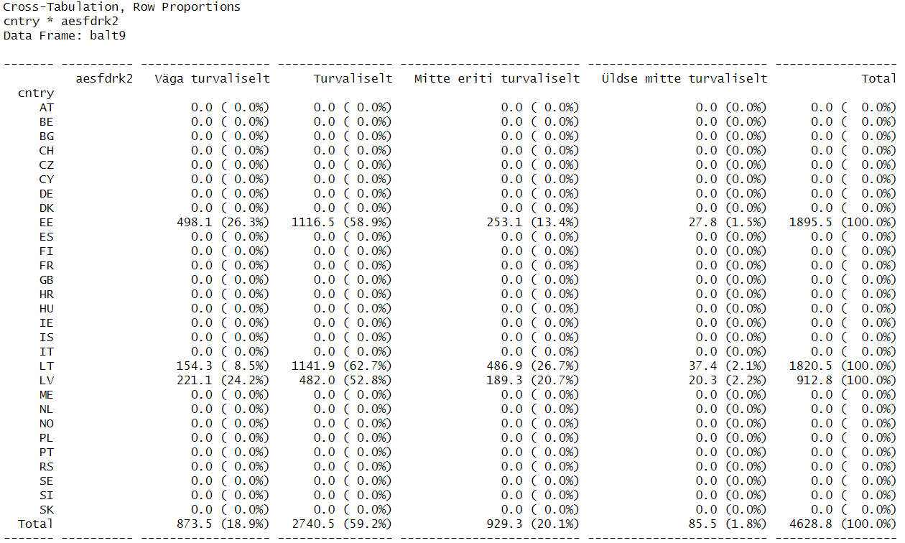

```{r setup, include=FALSE, message = FALSE, warning = FALSE}
knitr::opts_chunk$set(echo = TRUE)
```

Laeme sisse tööks vajalikud paketid.

```{r message = FALSE, warning = FALSE}
library(haven)
library(tidyverse)
library(summarytools)
```

Laeme sisse tööks vajalikud andmed, need on samad Euroopa Sotsiaaluuringu 9. küsitluslaine andmed aastast 2018, mis praktikumieelsetes materjalides.

```{r}
r9 <- read_spss("data/ESS9e03_1.sav")
```

Töötame natuke tunnusega `aesfdrk`, kus on vastused küsimusele, kui turvaliselt tunneb respondent end, jalutades üksinda oma kodu ümbruses pimedal
ajal, kas väga turvaliselt, turvaliselt, mitte eriti turvaliselt või üldse mitte turvaliselt. Kuna teeme algandmestikust erinevaid alaandmestikke, siis mõttekas on tunnusele lisada sõnalised väärtused juba algandmestikus `r9`.

## Ülesanne 2.1 {.tabset .tabset-fade .tabset-pills}

### Ülesanne 

Muutke tunnuses `aesfdrk` arvulised väärtused sõnalisteks. Siin on võimalik kasutada nii andmestikus olemasolevaid ingliskeelseid märgendeid kui ümber kodeerida tunnus eestikeelseks. Proovige teist varianti - esimene on küll lihtsam, aga tihtipeale, kui meil on vaja näiteks esitada analüüsitulemusi eestikeelsele auditooriumile, on tarvis ka tunnuste sisu eestikeelseks muuta.

### Vihje

Tunnuse väärtuste ümberkodeerimiseks saab kasutada paketi `dplyr` funktsiooni `recode`. Et kontrollida, kas ümberkodeerimine töötab õigesti, saate teha sagedustabeli enne ja pärast ümberkodeerimist.

### Vihje 2

Selleks, et tunnuse kategooriate järjestus jääks samas, mis algtunnuses, saab algtunnuse ümberkodeerimisel muuta faktortunnuseks funktsiooniga `as.factor`.

### Tulemus

Kas ümberkodeerimine töötas, saab kontrollida sagedustabeliga enne ja pärast ümberkodeerimist.

```{r echo = FALSE}
table(r9$aesfdrk)

r9 <- r9 %>% 
  mutate(aesfdrk2 = recode(as.factor(aesfdrk),
                          "1" = "Väga turvaliselt",
                          "2" = "Turvaliselt",
                          "3" = "Mitte eriti turvaliselt",
                          "4" = "Üldse mitte turvaliselt"))
table(r9$aesfdrk2)
```

### Lahendus

```{r eval = FALSE}
table(r9$aesfdrk)

r9 <- r9 %>% 
  mutate(aesfdrk2 = recode(as.factor(aesfdrk),
                          "1" = "Väga turvaliselt",
                          "2" = "Turvaliselt",
                          "3" = "Mitte eriti turvaliselt",
                          "4" = "Üldse mitte turvaliselt"))

table(r9$aesfdrk2)
```


## Ülesanne 2.2 {.tabset .tabset-fade .tabset-pills}

### Küsimus

Kui suur osa Eesti vastajatest arvas, et tunneksid end pimedal ajal kodu ümbruses jalutades väga turvaliselt? Kui suur osa tunneb end üldse mitte turvaliselt? Tehke siin ja edaspidi arvutused andmeid kaaludes.

### Vihje

Küsimusele saab vastata, eraldades algandmestikust Eesti andmed ja koostades tunnuse `aesfdrk` jaotuse. Kaalutud jaotuse saab nt funktsiooniga `freq` paketist `summarytools`. NB! Funktsioon `freq` ei soovi kaalu tunnuse jaoks eraldi argumendina andmestiku nime, vaid andmestiku ja tunnuse nime üheskoos (eraldatuna dollarimärgiga), seetõttu on siin `dplyr`'i funktsioonide kasutamine üheskoos `freq`'iga (andmestiku filtreerimine ja tulemuse pipe'iga edastamine `freq`'ile) keeruline. Lihtsam on teha alamandmestik, kus on ainult Eesti andmed ja kasutada jaotuse koostamisel seda.

Ülesanne on võimalik lahendada ka ainult `dplyr`iga, kasutades funktsioone `count` ja `mutate`.

### Tulemus

Funktsiooniga `freq`:

```{r echo = FALSE}
ee9 <- r9 %>% 
  filter(cntry == "EE")

freq(ee9$aesfdrk2, weights = ee9$pspwght)
```

`dplyr`i funktsioonidega:

```{r echo = FALSE}
ee9 <- r9 %>% 
  filter(cntry == "EE")

ee9 %>% 
  count(aesfdrk2, wt = pspwght) %>% 
  mutate(protsent = n / sum(n) * 100)
```

`dplyr`i funktsioonidega, ilma andmelünkade sageduseta (vt koodi lahenduse paanilt):

```{r echo = FALSE}
ee9 %>% 
  drop_na(aesfdrk2) %>% 
  count(aesfdrk2, wt = pspwght) %>% 
  mutate(protsent = n / sum(n) * 100)
```

### Lahendus

```{r eval = FALSE}
ee9 <- r9 %>% 
  filter(cntry == "EE")

freq(ee9$aesfdrk2, weights = ee9$pspwght)
```

`dplyr`i funktsioonidega:

```{r eval = FALSE}
ee9 <- r9 %>% 
  filter(cntry == "EE")

ee9 %>% 
  count(aesfdrk2, wt = pspwght) %>% 
  mutate(protsent = n / sum(n) * 100)
```

Kui soovime arvutade protsentjaotuse ilma andmelünkade sageduseta, saab kasutada lisaks funktsiooni `drop_na`:

```{r eval = FALSE}
ee9 %>% 
  drop_na(aesfdrk2) %>% 
  count(aesfdrk2, wt = pspwght) %>% 
  mutate(protsent = n / sum(n) * 100)
```


## Ülesanne 2.3 {.tabset .tabset-fade .tabset-pills}

### Küsimus

Millistes Eesti regioonides tuntakse end turvalisemalt, kus vähem turvaliselt? Kõige ülevaatlikum oleks sellele küsimusele vastata risttabeliga. Kuidas peaksite risttabelis protsendid seadistama, et küsimusele oleks kõige lihtsam vastata? Proovige nii rea-, veeru- kui üldprotsente ja uurige, kuidas neid oleks õige tõlgendada, mida erinevad protsendid järeldada võimaldavad.

Kodeerige enne regiooni tunnus koodidest sõnalisteks väärtusteks. Regiooni tunnus `region` põhineb NUTS-3 klassifikatsioonil, leiate selle kohta kõige kiiremini infot (mis kood vastab millisele regioonile) guugeldades nt "nuts 3 eesti". 

Täpsustus: NUTS-3 Eesti regioonide koodide kohta võite leida erinevat infot, ühe versiooni järgi on Kesk-Eesti kood EE006 ja Kirde-Eesti EE007, teise versiooni järgi on need koodid EE009 ja EE00A. Põhjus on selles, et aasta-paar tagasi NUTS-3 koode veidi muudeti. ESS 9. laine andmestikus on kasutatud varasemaid koode, st esimest versiooni:

- EE001 -- Põhja-Eesti
- EE004 -- Lääne-Eesti
- EE006 -- Kesk-Eesti
- EE007 -- Kirde-Eesti
- EE008 -- Lõuna-Eesti

Andmelünki on turvalisuse tunnuses väga vähe, jätke need tabelist välja.

### Vihje

Risttabeli saab moodustada funktsiooniga `ctable` paketist `summarytools`. Protsente saab selle funktsiooni puhul seadistada argumendiga `prop`, andmelünki jaotustest välja jätta argumendiga `useNA`. Nende argumentide võimalikke väärtusi uurige vajadusel funktsiooni abifailist käsuga `?ctable`.

### Tulemus

```{r echo = FALSE}
ee9 <- ee9 %>% 
  mutate(region2 = recode(as.factor(region),
                         "EE001" = "Põhja-Eesti",
                         "EE004" = "Lääne-Eesti",
                         "EE006" = "Kesk-Eesti",
                         "EE007" = "Kirde-Eesti",
                         "EE008" = "Lõuna-Eesti"))

ctable(ee9$region2, ee9$aesfdrk2, weight = ee9$pspwght, useNA = "no")

ctable(ee9$region2, ee9$aesfdrk2, weight = ee9$pspwght, prop = "c", useNA = "no")

ctable(ee9$region2, ee9$aesfdrk2, weight = ee9$pspwght, prop = "t", useNA = "no")
```

### Lahendus

```{r eval = FALSE}
ee9 <- ee9 %>% 
  mutate(region2 = recode(as.factor(region),
                         "EE001" = "Põhja-Eesti",
                         "EE004" = "Lääne-Eesti",
                         "EE006" = "Kesk-Eesti",
                         "EE007" = "Kirde-Eesti",
                         "EE008" = "Lõuna-Eesti"))
```

Tagantjärele täiendus: kuna algtunnuse `region` märgendid on eestikeelsed, siis piisab siin tunnuse sisu eestikeelseks muutmiseks alljärgnevast lihtsamast käsust. Selle eelis on muuhulgas see, et kui regiooni tunnust `recode`-funktsiooniga ümber kodeerides saite järgnevalt `ctable`-käsuga risttabeli, kus olid ka teiste riikide regioonid näidatud (olgugi, et teiste riikide vastajate andmeid objektis `ee9` ei ole), siis funktsiooni `as_label` kasutades need read `ctable`-käsu väljundist elimineeritakse.

```{r eval = FALSE}
ee9 <- ee9 %>% 
  mutate(region2 = sjlabelled::as_label(region, drop.levels = TRUE))
```

Märkus: kirjutades funktsiooni `as_label` ette `sjlabelled::`, pole tarvis paketti `sjlabelled` eraldi `library`-käsuga sisse laadida ja on tagatud, et kui ka mõnes teises paketis esineb funktsioon, mis on sama nimega, siis kasutatakse just paketis `sjlabelled` olevat `as_label`-funktsiooni.

```{r eval = FALSE}
ctable(ee9$region2, ee9$aesfdrk2, weight = ee9$pspwght, useNA = "no")

ctable(ee9$region2, ee9$aesfdrk2, weight = ee9$pspwght, prop = "c", useNA = "no")

ctable(ee9$region2, ee9$aesfdrk2, weight = ee9$pspwght, prop = "t", useNA = "no")
```


## Ülesanne 2.4 {.tabset .tabset-fade .tabset-pills}

### Küsimus

Kuidas hindavad oma kodukoha turvalisust Eesti, Läti ja Leedu elanikud? Millises riigis tuntakse end turvalisemalt, kus vähem turvaliselt? Mille poolest erinevad Eesti ja Leedu elanike turvalisuse hinnangute jaotused?

### Vihje

Kõiki ülesande lahendamiseks vajalikke funktsioone oleme täna eelnevalt juba kasutanud. Et saada risttabelisse ainult kolme riigi andmed, tuleb algandmestikust `r9` filtreerida välja ainult Balti riikide andmed. Seejärel saab teha risttabeli funktsiooniga `ctable`.

### Tulemus

```{r echo = FALSE}
balt9 <- r9 %>% 
  filter(cntry %in% c("EE", "LV", "LT"))

ctable(balt9$cntry, balt9$aesfdrk2, weights = balt9$pspwght, useNA = "no")
```

### Lahendus

```{r eval = FALSE}
balt9 <- r9 %>% 
  filter(cntry %in% c("EE", "LV", "LT"))

ctable(balt9$cntry, balt9$aesfdrk2, weights = balt9$pspwght, useNA = "no")
```

Kui eelneva lahenduse puhul saite väljundisse lisaks Eestile, Lätile ja Leedule ka teiste riikide read (kus on küll ainult nullid, sest objektis `balt9` teiste riikide vastajate andmeid pole) nagu alloleval pildil, 



siis nende elimineerimiseks saab siingi kasutada funktsiooni `as_label` paketist `sjlabelled`:

```{r eval = FALSE}
balt9 <- balt9 %>% 
  mutate(cntry = sjlabelled::as_label(cntry, drop.levels = TRUE))

ctable(balt9$cntry, balt9$aesfdrk2, weights = balt9$pspwght, useNA = "no")
```

Kui on vaja, saab käsku täiendades muuta riikide nimed eestikeelseks:

```{r}
balt9 <- balt9 %>% 
  mutate(cntry = sjlabelled::as_label(cntry, drop.levels = TRUE),
         cntry = recode(as.factor(cntry),
                          "Estonia" = "Eesti",
                          "Latvia" = "Läti",
                          "Lithuania" = "Leedu"))
```

Eestikeelsete riiginimedega tabel:

```{r}
ctable(balt9$cntry, balt9$aesfdrk2, weights = balt9$pspwght, useNA = "no")
```

## Ülesanne 2.5 {.tabset .tabset-fade .tabset-pills}

### Küsimus

Võtame uuesti Eesti andmed. Praktikumieelsetes materjalides kasutasime tervisehinnangu tunnust. Uurige nüüd, kas hinnang oma tervisele on seotud turvalisuse hinnanguga ehk kas need Eesti elanikud, kes hindavad positiivsemalt oma tervist, näevad positiivsemalt ka turvalisuse olukorda oma elukohas. Väga halvaks on oma tervise hinnanud vähe inimesi, nende omakorda jaotamine turvalisuse hinnangute alusel ei annaks eriti usaldusväärset jaotust, seega võiks halva ja väga halva tervisehinnanguga indiviidid kodeerida kokku ühte kategooriasse.

Kui mingi seos kahe tunnuse vahel peaks ilmnema, kuidas seda sisuliselt mõtestada? Miks peaks need kaks hinnangut omavahel seotud olema? Kas saab eeldada põhjusliku seose olemasolu kahe tunnuse vahel (see, mida arvatakse ühe küsimuse osas, mõjutab hinnangut teises küsimuses)? Kas põhjusliku seose asemel on mõistuspärasem mingi alternatiivne seletus?

### Vihje

Ka käesolevas ülesandes kasutatavaid funktsioone oleme täna eelnevalt juba kasutanud.

### Tulemus

```{r echo = FALSE}
ee9 <- ee9 %>% 
  mutate(health2 = recode(as.factor(health), 
                          "1" = "Väga hea", 
                          "2" = "Hea", 
                          "3" = "Rahuldav", 
                          "4" = "Halb", 
                          "5" = "Halb"))

ctable(ee9$health2, ee9$aesfdrk2, weights = ee9$pspwght, useNA = "no")
```

### Lahendus

```{r eval = FALSE}
ee9 <- ee9 %>% 
  mutate(health2 = recode(as.factor(health), 
                          "1" = "Väga hea", 
                          "2" = "Hea", 
                          "3" = "Rahuldav", 
                          "4" = "Halb", 
                          "5" = "Halb"))

ctable(ee9$health2, ee9$aesfdrk2, weights = ee9$pspwght, useNA = "no")
```

## Ülesanne 2.6 {.tabset .tabset-fade .tabset-pills}

### Küsimus

Eelmises ülesandes ilmnenud seose üks seletus võiks olla, et kehvemalt hindavad oma tervis pigem vanemad inimesed ning võib-olla on ka vanematel inimestel rohkem hirme turvalisuse osas. Uurige, kas sellisel seletusel võiks olla tõepõhi all.

### Vihje

Üks võimalus seda kontrollida oleks kodeerida vanuse tunnus kategoriaalseks (nt viis kategooriat, uurige enne tunnuse `agea` kumulatiivse jaotuse põhjal, kuhu kategooriate piirid seada, et grupid oleksid enam-vähem ühesuurused) ja teha risttabel vanuse ja tervisehinnangu tunnustega ning risttabel vanuse ja turvalisuse hinnangu tunnustega. Kui mõlemast ilmneb seos, võib see seletus pädeda küll.

### Tulemus

```{r echo = FALSE}
freq(ee9$agea)
ee9 <- ee9 %>% 
  mutate(vanus = case_when(agea <= 30 ~ "15-30",
                           agea <= 45 ~ "31-45",
                           agea <= 60 ~ "46-60",
                           agea <= 75 ~ "61-75",
                           agea > 75 ~ "76+"))

ctable(ee9$vanus, ee9$health2, weights = ee9$pspwght, useNA = "no")
ctable(ee9$vanus, ee9$aesfdrk2, weights = ee9$pspwght, useNA = "no")
```

### Lahendus

```{r eval = FALSE}
freq(ee9$agea)
ee9 <- ee9 %>% 
  mutate(vanus = case_when(agea <= 30 ~ "15-30",
                           agea <= 45 ~ "31-45",
                           agea <= 60 ~ "46-60",
                           agea <= 75 ~ "61-75",
                           agea > 75 ~ "76+"))

ctable(ee9$vanus, ee9$health2, weights = ee9$pspwght, useNA = "no")
ctable(ee9$vanus, ee9$aesfdrk2, weights = ee9$pspwght, useNA = "no")
```